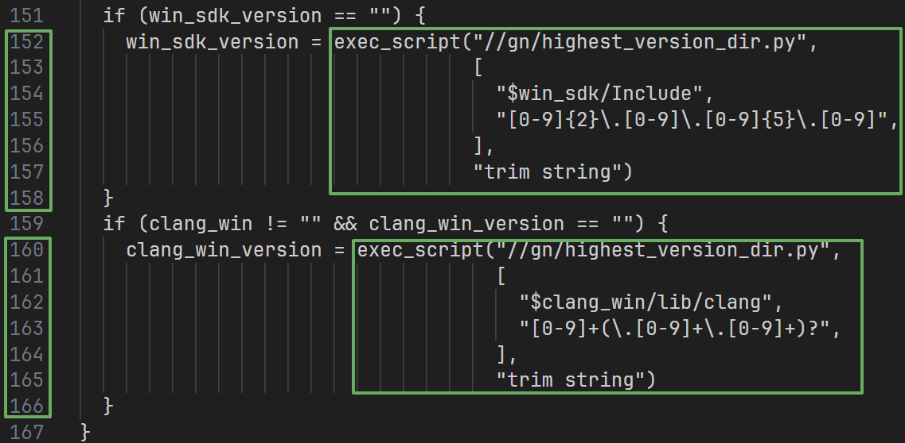
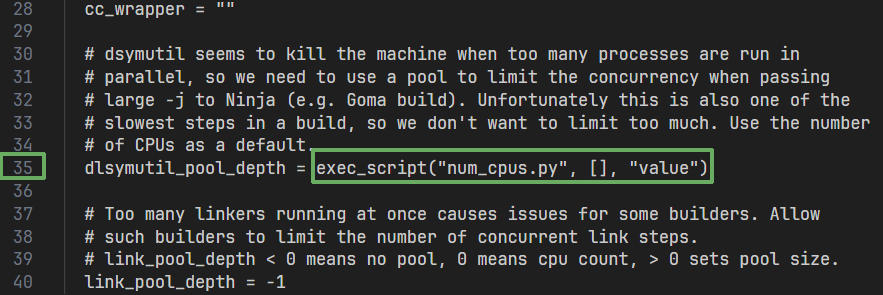
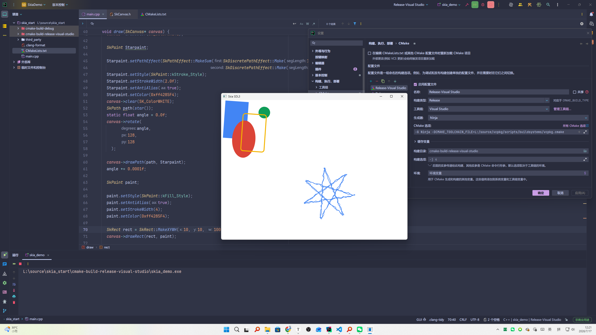

+++
date = '2026-07-16T22:28:20+08:00'
title = 'Skia编译流程'
showTableOfContents = 'true'

+++

# [Skia](https://skia.org) Windows环境下编译
## Skia介绍


一个开源的 2D 图形库，提供可在各种硬件和软件平台上运行的通用 API，Google Chrome 和 ChromeOS、Android、Flutter 以及许多其他产品的图形引擎，由 Google 赞助和管理，但任何人都可以根据 BSD 自由软件许可证使用它
## 前期准备工作
### 安装工具
[depot_tools](http://www.chromium.org/developers/how-tos/install-depot-tools) 

```shell
#powershell

git clone 'https://chromium.googlesource.com/chromium/tools/depot_tools.git'
#将X:\xxx\depot_tools 添加到环境变量 重启powershell
```

[Git](https://git-scm.com/)，[LLVM](https://releases.llvm.org/download.html)，[Python](https://www.python.org/downloads/)，[VisualStudio](https://visualstudio.microsoft.com/zh-hans/)

(注意: **留足储存空间** | 安装位置最好**不要有中文,空格,符号等 **| 建议**全程科学上网**)

### 克隆Skia源码并初始化
```shell
#powershell

git clone https://skia.googlesource.com/skia.git

cd skia
python tools/git-sync-deps
#如果输出字样中有Error,fatal不用管，继续等待执行完再重复上方命令，直到无Error,fatal

python bin/fetch-ninja

#将X:\xxx\skia\third_party\ninja 添加到环境变量 重启powershell
```


## 编译Skia

### 配置编译环境

记录 VC目录: `X:\xxx\Microsoft Visual Studio\18\Community\VC`  (注意: 这里的18，老版本VC可能年号2022 2021等)

与 `X:\xxx\Microsoft Visual Studio\18\Community\VC\Tools\MSVC\`下的MSVC版本号: NN.NN.NNNNN

编辑 `X:\xxx\skia\gn\BUILDCONFIG.gn`


修改为: 

```shell
if (target_os == "win") {
  # By default we look for 2017 (Enterprise, Pro, and Community), then 2015. If MSVC is installed in a
  # non-default location, you can set win_vc to inform us where it is.

  if (win_vc == "") {
    win_vc = "X:\xxx\Microsoft Visual Studio\18\Community\VC" #注意加 " "
  }
  assert(win_vc != "")  # Could not find VC installation. Set win_vc to your VC
                        # directory.
}

if (target_os == "win") {
  if (win_toolchain_version == "") {
    win_toolchain_version = "NN.NN.NNNNN" #注意加 " "
  }
```

保存后打开Visual Studio Installer，点击修改，左侧记录WindowsKit版本号`NN.NN.NNNNN`


记录LLVM 主版本号`NN`(两位数)

```shell
clang --version 
```



修改为

```shell
  if (win_sdk_version == "") {
    win_sdk_version = "NN.NN.NNNNN" #注意加 " "
  }
  if (clang_win != "" && clang_win_version == "") {
    clang_win_version = "NN" #注意加 " "
  }
}
```

保存并接着打开`X:\xxx\skia\gn\toolchaim\BUILD.gn`
记录你的CPU核心数`NN`


```shell
dlsymutil_pool_depth = "NN" 
```
确保**depot_tools，ninja，LLVM，Python**都已配置好环境变量

### 开始编译
X64
修改LLVM路径 `X:/xxx/LLVM\`
输出在 `X:\xxx\skia\out`
静态库

```shell
#powershell

cd X:\xxx\skia\

bin/gn gen out/Static --sln="skia_vs" --ide="vs" -args='is_official_build=true clang_win=\X:/xxx/LLVM\"
cc=\"clang\" cxx=\"clang++\" skia_use_system_expat=false skia_use_system_libjpeg_turbo=false
skia_use_system_libpng=false skia_use_system_libwebp=false skia_use_system_zlib=false
skia_use_system_icu=false skia_use_system_harfbuzz=false'

ninja -C out/Static

```

动态库

```shell
bin/gn gen out/Shared --sln="skia_vs" --ide="vs" -args='is_official_build=true is_component_build=true clang_win=\"X:/xxx/LLVM\"
cc=\"clang\" cxx=\"clang++\" skia_use_system_expat=false skia_use_system_libjpeg_turbo=false
skia_use_system_libpng=false skia_use_system_libwebp=false skia_use_system_zlib=false
skia_use_system_icu=false skia_use_system_harfbuzz=false'

ninja -C out/Shared
```


```cpp
SkPath star() {
  const SkScalar R = 115.2f;
  const SkScalar C = 128.0f;

  // 偏移量
  const SkScalar offsetX = 350.0f;
  const SkScalar offsetY = 250.0f;

  SkPathBuilder path;

  path.moveTo(
      C + R + offsetX,
      C + offsetY
  );
  for (int i = 1; i < 8; ++i) {

    SkScalar a = 2.6927937f * i;

    path.lineTo(
        C + R * cos(a) + offsetX,
        C + R * sin(a) + offsetY
    );
  }
  return path.detach();
}

void draw(SkCanvas* canvas) {
  canvas->drawColor(SK_ColorWHITE);

  SkPaint Starpaint;

  Starpaint.setPathEffect(SkPathEffect::MakeSum(SkDiscretePathEffect::Make(10.0f, 4.0f),
                                              SkDiscretePathEffect::Make(10.0f, 4.0f, 1245u)));
  Starpaint.setStyle(SkPaint::kStroke_Style);
  Starpaint.setStrokeWidth(2.0f);
  Starpaint.setAntiAlias(true);
  Starpaint.setColor(0xff4285F4);
  canvas->clear(SK_ColorWHITE);
  SkPath path(star());
  static float angle = 0.0f;
  canvas->rotate(
        angle,
        128,
        128
    );

  canvas->drawPath(path, Starpaint);
  angle += 0.0001f;

  SkPaint paint;

  paint.setStyle(SkPaint::kFill_Style);
  paint.setAntiAlias(true);
  paint.setStrokeWidth(4);
  paint.setColor(0xff4285F4);

  SkRect rect = SkRect::MakeXYWH(10, 10, 100, 160);
  canvas->drawRect(rect, paint);

  SkRRect oval;
  oval.setOval(rect);
  oval.offset(40, 80);
  paint.setColor(0xffDB4437);
  canvas->drawRRect(oval, paint);

  paint.setColor(0xff0F9D58);
  canvas->drawCircle(180, 50, 25, paint);

  rect.offset(80, 50);
  paint.setColor(0xffF4B400);
  paint.setStyle(SkPaint::kStroke_Style);
  canvas->drawRoundRect(rect, 10, 10, paint);
}

```