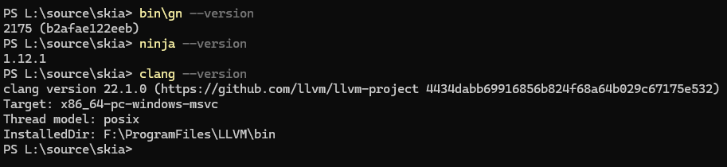
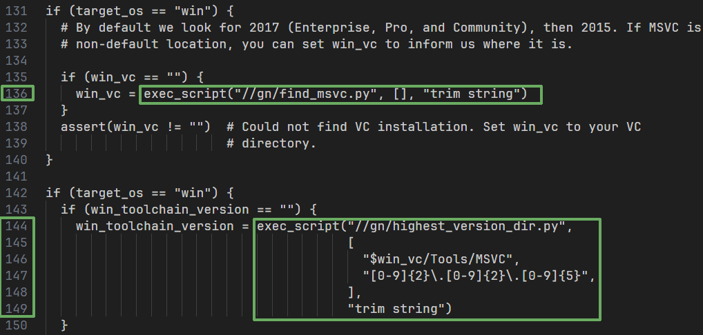
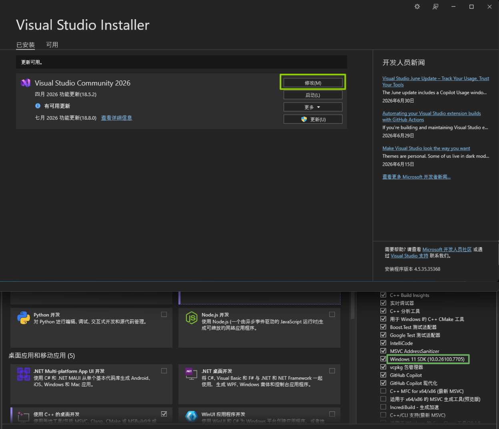

+++
date = '2026-07-16T22:28:20+08:00'
title = 'Skia在Windows环境下编译的流程'
showTableOfContents = 'true'

+++

# [Skia](https://skia.org) Windows环境下编译
## 前期准备工作
### 安装工具
[depot_tools](http://www.chromium.org/developers/how-tos/install-depot-tools) 

```shell
#powershell

git clone 'https://chromium.googlesource.com/chromium/tools/depot_tools.git'
#将X:\xxx\depot_tools 添加到环境变量 重启powershell
```

[Git](https://git-scm.com/)，[LLVM](https://releases.llvm.org/download.html)，[Python](https://www.python.org/downloads/)，[VisualStudio](https://visualstudio.microsoft.com/zh-hans/)

(注意: **留足储存空间** | 安装位置最好**不要有中文,空格,符号等 **| 建议**全程科学上网**)

### 克隆Skia源码并初始化
```shell
#powershell

git clone https://skia.googlesource.com/skia.git

cd skia
python tools/git-sync-deps
#如果输出字样中有Error,fatal不用管，继续等待执行完再重复上方命令，直到无Error,fatal

python bin/fetch-ninja

#将X:\xxx\skia\third_party\ninja 添加到环境变量 重启powershell
```



## 编译Skia
记录 VC目录: `X:\xxx\Microsoft Visual Studio\18\Community\VC`  (注意: 这里的18，老版本VC可能年号2022 2021等)

与 `X:\xxx\Microsoft Visual Studio\18\Community\VC\Tools\MSVC\`下的MSVC版本号: nn.nn.nnnnn

编辑 `X:\xxx\skia\gn\BUILDCONFIG.gn`



修改为: 

```shell
if (target_os == "win") {
  # By default we look for 2017 (Enterprise, Pro, and Community), then 2015. If MSVC is installed in a
  # non-default location, you can set win_vc to inform us where it is.

  if (win_vc == "") {
    win_vc = "X:\xxx\Microsoft Visual Studio\18\Community\VC" #注意加 " "
  }
  assert(win_vc != "")  # Could not find VC installation. Set win_vc to your VC
                        # directory.
}

if (target_os == "win") {
  if (win_toolchain_version == "") {
    win_toolchain_version = "nn.nn.nnnnn" #注意加 " "
  }
```

保存后打开Visual Studio Installer，点击修改，左侧查看WindowsKit版本号`NN.NNNN`


