+++
date = '2026-07-12T22:12:35+08:00'
draft = false
title = 'CS106B'
showTableOfContents = 'true'
+++
# 0.有关CS106B
CS106B 将带您熟悉 C++ 编程语言，并介绍递归、算法分析和数据抽象等高级编程技巧，探索经典的数据结构和算法，并让您有机会运用这些工具解决复杂问题 (注意:它不会教你基本语法, 在这之前, 你需要一点的编程经验)

由于cs106B各个年份课程的开源程度不同，我们想要学习这门课程就需要结合不同年份的课程资源

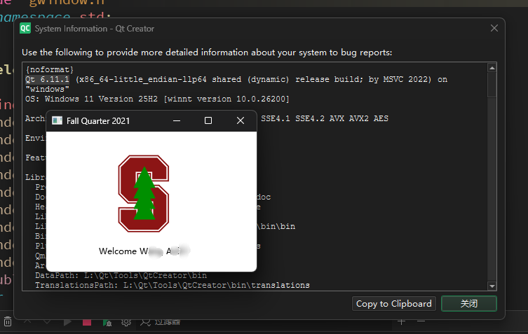

[Qt](https://www.qt.io/development/download-qt-installer-oss) Qt6.11可用

[StanfordLib 2021](https://github.com/MedivhGO/Stanford-CS106B/)

[Lectures 2020summer](https://web.stanford.edu/class/archive/cs/cs106b/cs106b.1242/lectures/)

[Sections 2022summer](https://web.stanford.edu/class/archive/cs/cs106b/cs106b.1228/about_section)

[Assignments 2022winter](https://web.stanford.edu/class/archive/cs/cs106b/cs106b.1224/about_assignments)

[Exams 2022winter](https://web.stanford.edu/class/archive/cs/cs106b/cs106b.1224/midterm_logistics)

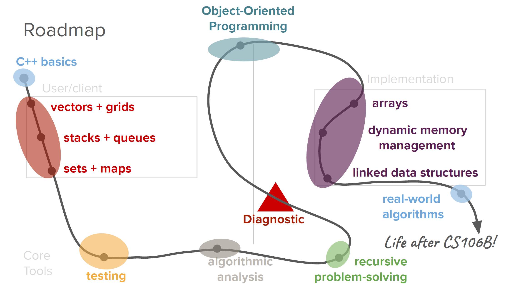

# 1.什么是抽象
抽象就是只告诉你这个东西能干什么，但不告诉你它到底是怎么干的, 抽象 = 隐藏**怎么做**，只暴露**做什么** 
*Design that hides the details of how something works while still allowing the user to access complex functionality*

世间一切都是抽象
例如:你用美团点外卖，只要选菜、下单、付款就行，不需要懂服务器、数据库、网络协议等怎么工作的

# 2.在代码中使用抽象概念来构建数据
- ADT的定义(*Abstract Data Type*)
ADT 是 “**你想让一个东西表现成什么样**，而**不是它内部怎么实现**” 常见的ADT: Vector,Queue,Stack

- 功能和实现的分离
实现于程序时，抽象数据类型只显现出其功能，并将实现加以隐藏 你只需关心它的功能，而不是如何实现，类似于可以不知道一些深奥的数学知识，但要会用它解决问题
# 4.值传递与引用传递
## 什么是值传递?
当一个参数传递给函数时，新变量会在内存中存储传递值的副本
```cpp
void tripleWeight(double w) {
 w *= 3; // 重量三倍
}

int main() {
 double weight = 1.06;
 tripleWeight(weight);
 cout << weight << endl; //weigt仍是1.06
}
```
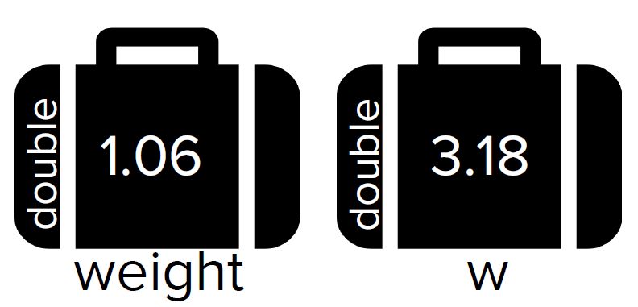

## 什么是引用传递?
当向函数传递参数时，新变量会存储对传入值的引用，这允许您直接编辑原始值 在类型后面加上`&`
```cpp
void tripleWeight(double& weight_ref) {
 weight_ref *= 3; // 重量三倍
}

int main() {
 double weight = 1.06;
 tripleWeight(weight);
 cout << weight << endl; //weight会变为3.18, 但我们通常不会这样编写代码……
} 
```
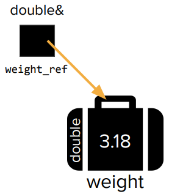
## 何时不使用引用传递?
- 如果我们总是使用引用，那么函数之间都可以互相修改对方的变量，程序的作用域会变得混乱
- 当数据本身很小(即按值复制的成本很低)时，我们就不需要使用引用
- 如果参数是引用,不能传入字面值

 :x:**错误示例**
```cpp
void tripleWeight(double& weight_ref);
...
tripleWeight(1.06);//别这么做!编译器出错 1.06是一个临时值，没有实际存储位置，不能被引用修改
```

# 5.有序数据结构

当说“无序”与“有序”时，我们特指数字排序

## Vector
- 从宏观层面来说，向量是相同类型元素的有序集合，其大小可以**增长或缩小** (注意:与数学向量不同)
- 集合中的每个元素都有一个特定的位置, 或称索引
- 向量中的所有元素必须是同一类型, 与其他编程语言不同，单个向量不能包含混合类型的元素
- 向量在存储元素数量方面非常灵活, 可以轻松地添加和删除元素、查询当前包含的元素数量等
### 基本向量运算
- 创建
`vector<int> vec;`
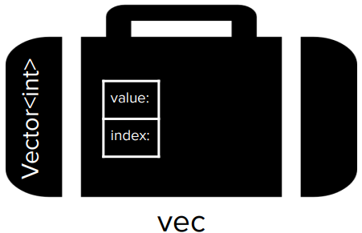

- 元素添加

`vec.add(4);`

`vec.add(8);`

`vec.add(15);`
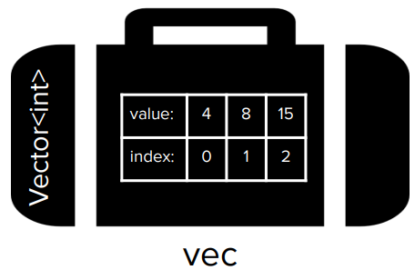
(注意：索引从`0`开始)

- 创造 + 添加
`vector<int> vec = {4, 8, 15};`
- 访问元素
`cout << vec[1] << endl;`
(注意: `cout << vec[3] << endl;` 这样做会抛出错误! Vector会进行边界检查, 不允许访问**超出边界的元素**)
- 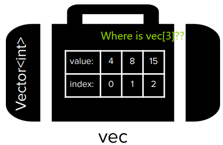
- 移除元素
`vec.remove(0);`(注意: index与value不绑定)
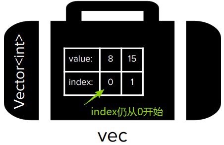
- 访问元素个数
  `cout << vec.size() << endl;`

   ```console
   output:2
  
- 遍历向量

    - 方法一：传统 for 循环

        ```cpp
        vector<int> vec = {1, 0, 6};

        for (int i = 0; i < vec.size(); i++) {
            cout << vec[i] << endl;
        }
        ```

    - 方法二：for each 循环

        ```cpp
         vector<int> vec = {1, 0, 6};
        
        for (int value : vec) {
            cout << value << endl;
        }
        ```
        ```console
        output:
        1
        0
        6
        ```
     ```cpp
- Vector函数实用功能
    - `vec.size()`：返回向量中元素的数量
    - `vec.isEmpty()`：判断向量是否为空，空返回 `true`，否则返回 `false`。
    - `vec[i]`：访问向量中第 `i` 个元素
    - `vec.add(value)`：在向量末尾添加一个元素
    - `vec.insert(index, value)`：在指定位置 `index` 前插入元素，后面的元素向后移动一位
    - `vec.remove(index)`：删除指定位置的元素，后面的元素向前移动一位
    - `vec.clear()`：清空向量中的所有元素
    - `vec.sort()`：按升序排列向量中的元素
      ```
### vector示例
- 消除负数:给定一个整数向量，编写一个函数，通过改变向量中所有负值的符号，将它们转换为对应的正值，从而消除向量中的负数
```cpp
void eliminateNegativity(vector<int> v)
{
  for (int i = 0; i < v.size(); i++)
  {
    if (v[i] < 0)
      v[i] *= -1; //负数 * -1
    cout << v[i] << endl;
  }
}

int main()
{
  vector<int> vec = {-1, 0, -4, 5};
  eliminateNegativity(vec);
  return 0;
}
```
## Grid
这是Stanford封装好的类 [Stanford Grid documentation](https://web.stanford.edu/dept/cs_edu/resources/cslib_docs/Grid)

- 一个二维数组，具有**特定**的宽度和高度(注意:这里我们用**数组**而不是向量,因为它在创建的时候就确定了行数和列数，所以不像vector那样可以随意增加元素)

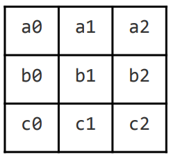

- 适用于电子表格、游戏棋盘等
- 声明Grid的三种方法
    ```cpp
    Grid<type> gridName;
    Grid<type> gridName(numRows, numCols);
    Grid<type> gridName = {{a0, a1, a2}, {b0, b1, b2},...};
    ```
- 实用功能
    ```cpp
    grid.numRows() //返回网格（grid）的行数
    grid.numCols() //返回网格（grid）的列数
    grid[i][j] //选择网格中第 i 行、第 j 列 的元素。
    grid.resize(rows, cols) //改变网格的尺寸(行数和列数),并将所有元素重新初始化为它们的默认值
    grid.inBounds(row, col) //如果指定的 行(row),列(col)位置在网格范围内,返回true,否则返回false
    ```
- 如何遍历Grid
```cpp
void printGrid(Grid<char>& grid) {
 for(int r = 0; r < grid.numRows(); r++) {
     for(int c = 0; c < grid.numCols(); c++) {
         cout << grid[r][c];
     }
     cout << endl;
  }
}

Grid<char> word = {{'y', 'e'}, {'e', 'h'}, {'a', 'w'}};
printGrid(word);
```

```console
output:
ye
eh
aw
```

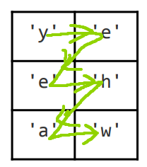

- 使用Grid时常见的陷阱
    - 别忘了指定Grid中存储的数据类型

    `Grid word; //NO!`
    
    `Grid<char> word; //YES~`
    
    - 与vector和其他抽象数据类型(ADT)一样,当网格用作函数参数时,应该按引用传递`&`
    - 使用网格索引时要注意变量的顺序! 建议使用`r`表示行,`c`表示列
    - 与其他语言不同,您只能访问单元格(不能访问单个行) `grid[0]` → 这样做会导致错误
    
- 战舰游戏网格系统
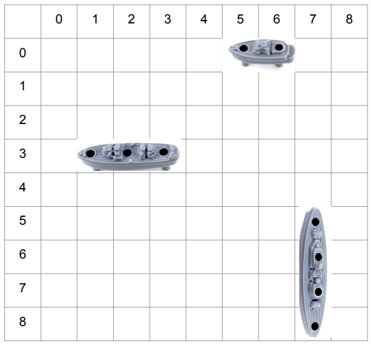

### Structs + GridLocation
#### 什么是struct
C++中将不同类型的信息捆绑在一起的方法——类似于创建自定义数据结构
#### GridLocation结构体
- Stanford C++库中预定义的结构体,可以更方便地存储网格位置 (就像一个坐标表示系统)
```cpp
struct GridLocation {
    int row;    
    int col;
}                     //结构定义(可以是不同类型的成员)
```

- 要声明一个结构体，你可以分别给每个成员赋值，也可以在创建结构体时一次性赋值

```cpp
GridLocation origin = {0, 0}; 
// or
GridLocation origin;
origin.row = 0;
origin.col = 0; //您可以使用点号表示法访问结构体中的成员 成员名后面不需要括号
```

## Queue
有Stanford封装好的类 [Stanford Grid documentation](https://web.stanford.edu/dept/cs_edu/resources/cslib_docs/Queue)
### 什么是Queue?

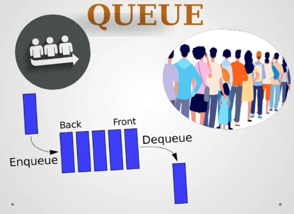

- 一种两端开放的线性数据结构
- 一个有序列表，允许在称为后部(REAR)的一端执行插入操作，在称为前部(FRONT)的另一端执行删除操作
- 先进先出(FIFO)列表 就像我们在食堂排队打饭一样 **F**irst person **I**n is the **F**irst person **O**ut

### 实用功能

```cpp
enqueue(value)  // or add(value )入队
dequeue()  // or remove() 离队 因为是先进先出 所以是移除首次添加的值
peek()  // or front() 查看队首
isEmpty() // 队列是否为空
```

### Queue示例

```cpp
Queue<int> line; // {}, empty queue
line.enqueue(42); // {42}
line.enqueue(-3); // {42, -3}
line.enqueue(17); // {42, -3, 17}
cout << line.dequeue() << endl; // 取出42 (队列目前为 {-3, 17})
cout << line.peek() << endl; // 显示-3 (队列目前为 {-3, 17})
cout << line.dequeue() << endl; // 取出-3 (队列目前为 {17})

// or
Queue<int> line = {42, -3, 17};
```
## Stack

### 什么是Stack
- 遵循后来居上，后进先出(LIFO)原则的抽象数据结构(ADT)  **L**ast item **I**n is the **F**irst one **O**ut

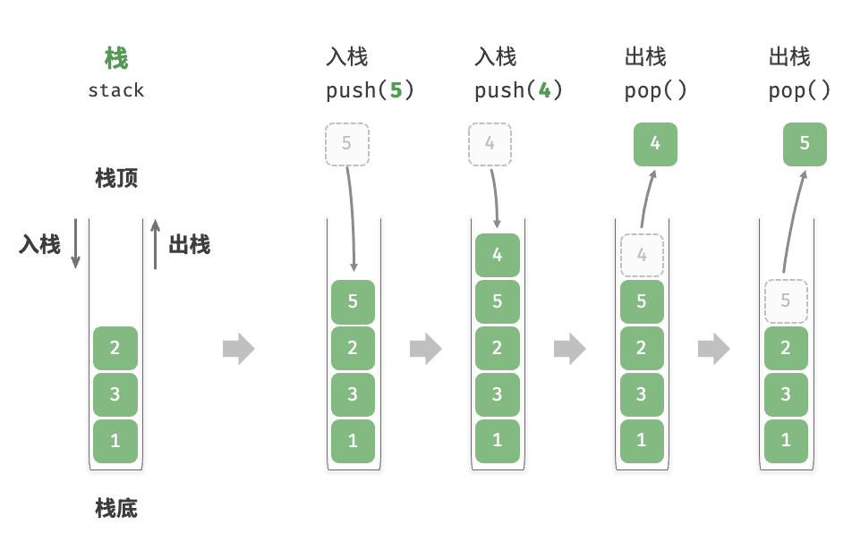

## Stack与Queue常见操作

```cpp
Stack<string> wordStack; // {}, empty stack
wordStack.push("Kylie"); // {"Kylie"}
wordStack.push("Nick"); // {"Kylie", "Nick"}
wordStack.push("Trip"); // {"Kylie", "Nick", "Trip"}
cout << wordStack.pop() << endl; // “Trip”
cout << wordStack.peek() << endl; // "Nick"
cout << wordStack.pop() << endl; // "Nick" (stack is {"Kylie"})
// 直接表示
Stack<string> wordStack = {"Kylie", "Nick", "Trip"};
// 顶部 是最右边的元素Trip
```
- 清空队列/栈

```cpp
//取出队列中的元素
Queue<int> queueIdiom1;
// produce: {1, 2, 3, 4, 5, 6}
for (int i = 1; i <= 6; i++) {
  queueIdiom1.enqueue(i);
}
while (!queueIdiom1.isEmpty()) {
  cout << queueIdiom1.dequeue() << " ";
}
cout << endl;
//output: 1 2 3 4 5 6

//取出栈中的元素
Stack<int> stackIdiom1;
// produce: {1, 2, 3, 4, 5, 6}
for (int i = 1; i <= 6; i++) {
  stackIdiom1.push(i);
}
while (!stackIdiom1.isEmpty()) {
  cout << stackIdiom1.pop() << " ";
}
cout << endl;
//output: 6 5 4 3 2 1
```

- 遍历和修改队列/栈 → 循环前只需计算一次大小

```cpp
//队列
Queue<int> queueIdiom2 = {1,2,3,4,5,6};

int origQSize = queueIdiom2.size();

for (int i = 0; i < origQSize; i++) {
   int value = queueIdiom2.dequeue();
 // 只保留偶数
   if (value % 2 == 0) {
       queueIdiom2.enqueue(value);
   }
}
cout << queueIdiom2 << endl;
//output: 2, 4, 6

//栈
Stack<int> stackIdiom2 = {1,2,3,4,5,6};
Stack<int> result;

int origSSize = stackIdiom2.size();

for (int i = 0; i < origSSize; i++) {
  int value = stackIdiom2.pop();
 // stackIdiom2的偶数添加到result
  if (value % 2 == 0) {
      result.push(value);
  }
}
cout << result << endl;
//output: 6, 4, 2
```

## Stack与Queue常见陷阱
- 别在循环条件里用 `.size()` 因为每一次循环`size`都会改变! 在循环开始前，应用一个固定变量把初始大小存起来
- 栈是一次性的! 队列有时候还可以提供只读的迭代器让我们从头扫到尾，但栈(Stack)不行！你想要遍历一个栈，唯一的办法就是不断地 `pop()` (弹出)它，而弹出来的元素就从原栈里消失了，在遍历前应先进行复制
## Stack与Queue的缺点
- **没有随机访问** 

  你想看队伍中间的人是谁？对不起，没门! 不像Vector,Grid那样可以使用索引(index):sweat_smile: 

- **没有无副作用的遍历**

  在不破坏它们的前提下，你无法把里面所有的元素扫一遍，你想看后面的元素，必须先把前面的元素全扔掉（出队/出栈）,遍历完了，这个容器也空了:neutral_face:

- **没有简单的搜索方法**

  你想在栈或队列里找一个特定的值?不行! 你只能苦哈哈地一个一个弹出来比对，找完了还得想办法把倒出来的元素再装回去:expressionless:

# 6.挑选合适的ADT
- Stacks **(LIFO 最后发生的，最先被处理)**

  文本编辑器中的**撤销**

  你的浏览器网页的**后退**

- Queues **(FIFO 先来后到，排队办事)**

  斯坦福计算机系著名的LaIR答疑预约系统->学生做实验遇到bug了，在系统上登记排队等助教，助教肯定去辅导**第一个**登记的学生

  客服热线->哪个客户先打进电话，谁就排在队伍**最前面**，一旦有客服空出来，就先接待谁
# 7.ADT目前为止总结

| 类型 | 是否支持索引访问 | 示例 | 特点 |
| --- | --- | --- | --- |
| **可通过索引访问的有序ADT** | ✅ 可以 | Vector, Grid | 灵活访问，适合遍历和按位置组织数据 |
| **无法通过索引访问元素的有序ADT** | ❌ 不可以 | Queue, Stack | 限制访问方式，适合特定顺序处理 |

核心区别

- **Vector / Grid**
  - 关注 **数据在哪里（where）**
  - 可以直接通过 index 找到元素
  - 例如：
    ```cpp
    vector[3];  // 直接访问第4个元素
    ```

- **Queue / Stack**
  - 关注 **数据处理顺序（how）**
  - 不允许随意访问中间元素
  - 例如：
    ```text
    Queue:
    First in → First out
    
    Stack:
    Last in → First out
    ```
# 8.无序数据结构
## 为什么我们要使用无序ADT
因为有时，使用数字索引/排序并不是存储信息的最有效方式！
## 无序数据示例
- 网站独立访客数
- 随机播放列表，无重复歌曲
- 特定航班上的乘客及其护照号码
- 一份包含所有食材及其用量的食谱
- 社交媒体内容包含，文本,表情,图片，没有统一结构

## Set
### 什么是Set
- 指不包含重复元素的元素的集合

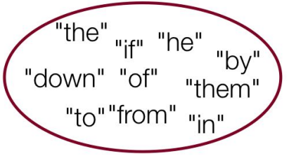

- 集合比向量等有序数据结构速度更快——因为集合中没有重复项，所以查找数据的速度更快

- 集合没有索引

### 使用功能
如需查看完整列表，请查看[Stanford libraries documentation](https://web.stanford.edu/dept/cs_edu/cppdoc/Set-class.html)

```cpp
add(value) //向集合中添加一个值。如果集合里已经有这个值，则不重复添加
contains(value) //检查集合中是否包含某个值。包含返回 true，否则返回 false。
remove(value) //集合中删除某个值。如果这个值不存在，什么也不做
size() //返回集合中元素的数量
isEmpty() //判断集合是否为空。为空返回 true，否则返回 false
```
### Set示例
```cpp
Set<string> friends;
friends.add("nick");
friends.add("kylie");
friends.add("trip");
// 也可以这样  Set<string> friends = {“nick”, “kylie”, “trip”};
cout << boolalpha << friends.contains("voldemort") << noboolalpha
    << endl;
for(string person : friends) {
    cout << person << endl;
}
```

### Set运算
`s1 == s2` 如果两个集合包含完全一样的元素，返回 `true` 与`s1 != s2`相对

`s1 + s2` 并集

`s1 * s2` 交集

`s1 - s2` 差集 返回存在于`s1`中但不在`s2`中 的元素

(注意: 元素全不重复)

### 常见集合模式和陷阱
- 使用for each循环遍历集合
```cpp
for (type currElem : set) {
 // process elements one at a time
}
```

- 任何试图对该集合进行索引的操作都不能使用

`for (int i = 0;..) or set[i]`

## Map
### 什么是Map

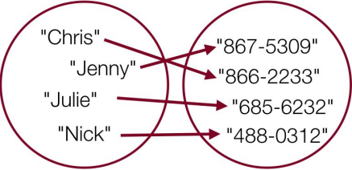

- Map(映射 / 哈希表) 是一种存储“键值对（key/value pair）”的数据结构
- 每个 key（键） 对应一个 `value`（值），通过 `key` 可以快速找到对应的 `value`

### 实用功能

```cpp
m.clear() //清空 Map，删除所有键值对
m.containsKey(key) //判断 Map 是否包含指定的键。包含返回 true，否则返回 false
m[key] //or m.get(key) 获取指定 key 对应的 value，如果 key 不存在，返回 value 类型的默认值
m.isEmpty() //判断 Map 是否为空。没有任何键值对返回 true
m.keys() //返回 Map 中所有 key 的集合（Vector）
m[key] = value //or m.put(key, value) 添加一个键值对，如果 key 已存在，则更新它对应的 value
m.remove(key) //删除指定 key 的键值对，如果 key 不存在，不做任何操作
m.size() //返回 Map 中键值对的数量
m.values() //返回 Map 中所有 value 的集合（Vector）
```
### Map示例
```cpp
// 将字符串键映射到字符串值
Map<string, string> phoneBook;

//插入新值
// key                value
phoneBook["Jenny"] = "867-5309"; // or
phoneBook.put("Jenny", "867-5309");

//访问值
string jennyNumber = phoneBook["Jenny"]; // or
string jennyNumber = phoneBook.get("Jenny");
cout << jennyNumber << endl;

// 将字符串键映射到 Vector<double> 值
Map<string, Vector<double>> accounts;
```
### 常见映射表模式和陷阱
- 使用for each循环遍历映射表
- 自动插入：一项map功能，但有时也会导致错误

```cpp
Map<string, int> freqMap;
while (true) {
    string text = getLine("Enter some text: ");
    cout << "Times seen: " << freqMap[text] << endl;
    freqMap[text]++; //自动插入仅在使用 [] 运算符时才会发生，而不会使用 .get() 函数
 } 
```

错误示例

```cpp
Map<string, int> freqMap;
//...
// 获取密钥以测试它是否在地图中
if (freqMap[key] == 0) { // 这个判断永远是true
cout << key << " is in the map" << endl;
}
```

正确示例

```cpp
Map<string, int> freqMap;
...
// 使用 containsKey 函数，不自动插入
if (freqMap.containsKey(key)) { // 正确的做法
    cout << key << " is in the map" << endl;
}
```

## ADT再次总结
### Ordered ADTs（有序抽象数据类型）

数据有明确顺序，可以按照位置访问。

| 类型 | 通俗理解 |
|---|---|
| Vectors（向量 / 一维数组） | 像一排储物柜，每个元素都有编号，可以通过下标访问，例如 `vec[3]` |
| Grids（网格 / 二维数组） | 像棋盘一样，有行和列，可以通过两个坐标访问，例如 `grid[2][5]` |
| Queues（队列） | 像排队买票，只能从队尾加入，从队头取出，先进先出 FIFO（First In First Out） |
| Stacks（栈） | 像一摞盘子，只能从顶部放入和取出，后进先出 LIFO（Last In First Out） |

---

### Unordered ADTs（无序抽象数据类型）

数据没有固定顺序，不能依靠位置访问。

适合用于：数字排序没有意义，更关注“是否存在”或“快速查找”的情况。

| 类型 | 通俗理解 |
|---|---|
| Sets（集合） | 存储不重复的数据，每个元素只能出现一次，例如 `{1,2,3}` |
| Keys（键） | 每个键必须唯一，用来快速找到对应的数据，例如字典中的“单词 → 解释” |

# 9.使用抽象
## 计数排序
一种非比较型排序算法。它的核心思想是统计数组中每个元素出现的次数，并将这些统计结果用来直接计算每个元素在排序后数组中的正确位置，从而避免元素之间的两两比较

- 现在，让我们考虑这个问题：如何高效地将单词中的所有字母按字母顺序排序？
- 我们如何利用最近学到的一些数据结构，对要排序的数据进行有意义的结构化处理？
- 想法：如果我们统计出从“a”到“z”的每个字母出现的次数，我们就可以构建一个新字符串，该字符串由正确数量的“b”，……等等

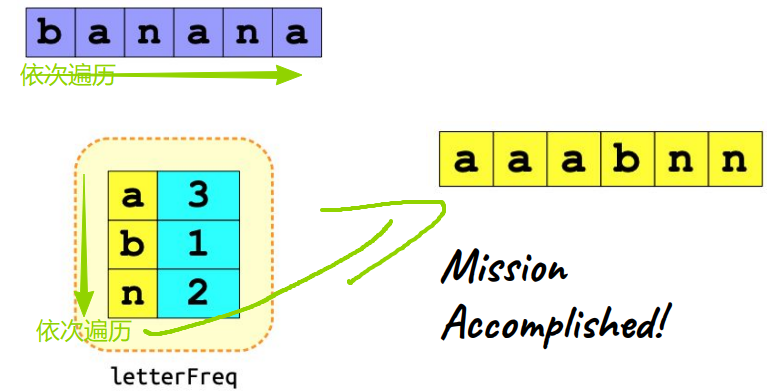

- 遍历单词并构建原始字符串中出现的所有字母的频率map
(注意:它没有天然的“统计”功能,但**ADT 不关心你存什么，只关心key-value关系**)
- 遍历从 'a' 到 'z' 的所有字母，并构建一个包含相应数量字母的新字符串
- 返回新生成的字符串

```cpp
string countingSort(string s) {

    map<char, int> freqMap;
    
    for (char ch: s) {
        freqMap[ch]++;
    }
    
    string sortedString;
    for (char ch = 'a'; ch <= 'z'; ch++) {
        for (int i = 0; i < freqMap[ch]; i++) { //如果ch不存在与s中,freqMap[ch] = 0
                sortedString.push_back(ch);
            }
        }
    return sortedString;
}
```

## 单词梯问题
给你两个单词，你需要像爬楼梯一样，一步一步改变字母，最后从起始单词变成目标单词，每一步得到的**新单词都必须是真实存在**的英文单词

COLD -> CORD -> CARD -> WARD -> WARM

一个直观想法是模拟人类解题过程：
1. 从起始单词开始
2. 猜测应该改变哪个字母
3. 修改字母，生成新的合法英文单词
4. 重复这个过程，直到：
   - 到达目标单词
   - 或走入死路，然后重新尝试

### 需要直觉
人类可以凭经验判断下一步，但：
> 计算机没有“感觉”，不知道哪个方向更好
---
### 搜索无组织
这种方法类似乱走迷宫：
- 不知道先探索哪里
- 可能重复尝试
- 没有记录搜索过程

---

### 无法保证找到答案
即使存在解：
> 随机尝试也可能永远找不到正确路径

猜测 → 尝试 → 失败 → 重来 不适合计算机 那怎么办？🫤

## BFS
### 什么是BFS
**广度优先搜索(BFS)** 一种逐层向外扩散的图遍历算法，它从起点开始，先访问所有直接相邻的节点，再依次访问邻居的邻居


  ```text
                COLD
              /  |   \
          BOLD  CORD  SOLD
          /       |      \
     ❌  BALD     CARD    SORD  ❌
                   |
                 WARD 
                   |
                 WARM
  ```

### BFS所需要的数据结构
| 功能        | 数据结构需求     | 常用 ADT         |
| --------- | ---------- | -------------- |
| 保存一条路径    | 快速访问最后一个单词 | Vector / Stack |
| 保存等待探索的路径 | 按长度顺序处理    | Queue          |
| 记录访问过的单词  | 快速查找是否存在   | Set            |

核心思想:
> BFS 不直接搜索单词，而是搜索**可能的路径**，每次扩展一层

### 解决单词梯问题
1. 初始化：
    - 创建一个**队列**用于存放待处理的路径。
    - 创建一个**集合**记录已访问过的单词（防止重复搜索）
    - 将包含“起始单词”的路径存入队列

2.  循环处理（当队列不为空时）：
    *   从队列中取出一个**路径**
    *   取出路径末尾的单词作为“当前单词”
    *   **判断**：如果当前单词等于“目标单词”，直接返回该路径，搜索结束。

3.  扩展节点：
    - 寻找所有与“当前单词”仅相差一个字母且合法的“邻居单词”。
    - 遍历这些邻居：
        - 如果该邻居**尚未被访问过**：
            - 标记该邻居为“已访问”
            - 复制当前路径，并将该邻居添加到路径末尾
            - 将这条新路径加入队列尾部，继续下一轮探索

## NDS
### 什么是NDS

> NOT END
